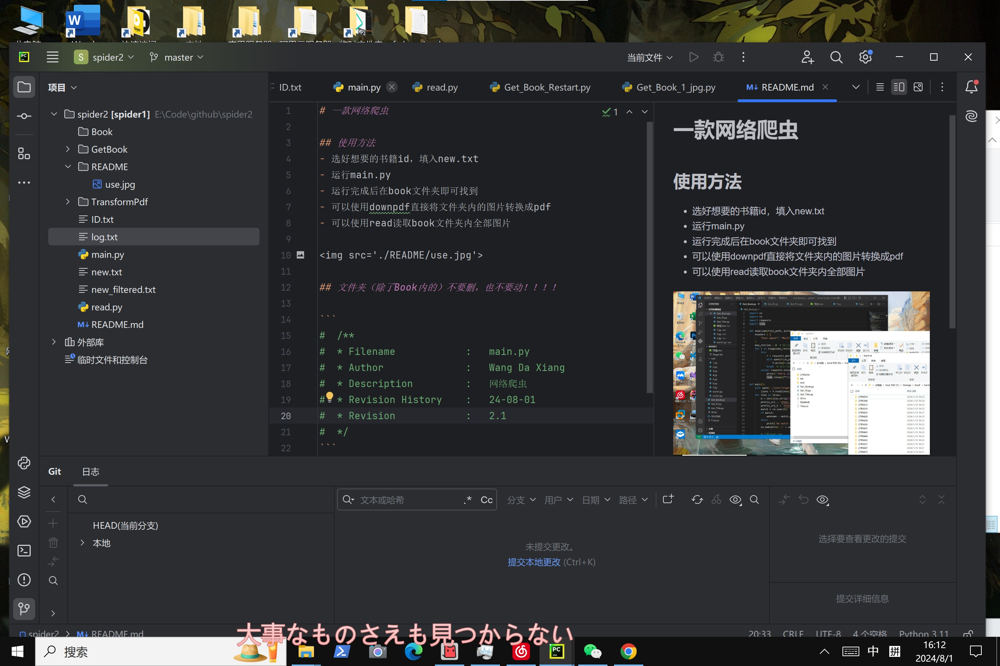

# 一款网络爬虫

## 使用方法
- 选好想要的书籍id，填入new.txt
- 运行main.py
- 运行完成后在book文件夹即可找到
- 可以使用downpdf直接将文件夹内的图片转换成pdf
- 可以使用read读取book文件夹内全部图片



## 文件夹（除了Book内的）不要删，也不要动！！！！

```
#  /**
#  * Filename            :   main.py
#  * Author              :   yoshinosuki
#  * Description         :   网络爬虫
#  * Revision History    :   24-08-01
#  * Revision            :   2.2
#  */
```