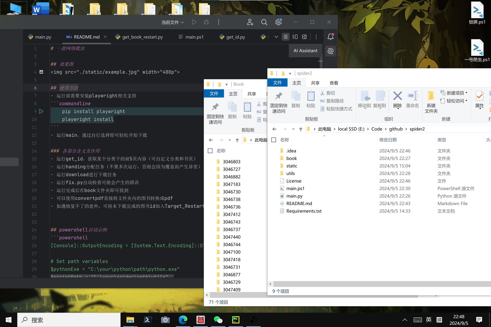

# 一款网络爬虫

## 效果图


## 使用方法
- 运行前需要安装playwright相关支持
```commandline
    pip install playwright
    playwright install
```
- 运行main，通过自行选择即可轻松开始下载

### 各部分含义及作用
- 运行get_id，获取某个分类下的前5页内容（可自定义分类和书页）
- 运行handing分配任务（不要多次运行，否则会因为覆盖而产生异常）
- 运行download进行下载任务
- 运行fix.py自动检查可能会产生的错误
- 运行完成后在book文件夹即可找到
- 可以使用convertpdf直接将文件夹内的图书转换成pdf
- 如遇修复不了的意外，可将未下载完成的图书id加入Target_Restart文件中，运行restart
- restart提供了全部错误提示，方便查看错误环节


## powershell启动示例
```powershell
[Console]::OutputEncoding = [System.Text.Encoding]::UTF8

# Set path variables
$pythonExe = "C:\your\python\path\python.exe"
$scriptPath = "C:\your\spider\path\utils"

trap {
    Write-Host "warning: $_"
    exit
}
$choice1 = Read-Host "Enter '1' to start from getting ID or enter '2' to continue from the last download progress`n"
Set-Location $scriptPath
function Validate-Url {
    param (
        [string]$url
    )
    if ($url -match '^(https?|ftp)://[^\s/$.?#].[^\s]*$') {
        return $true
    }
    else {
        return $false
    }
}
if ($choice1 -eq '1') {
    $choice2 = Read-Host "Enter '1' to download using default category`nEnter '2' to download Chinese category`nEnter '3' to download uncensored Chinese category`nEnter '4' to download using a url`n"
    if ($choice2 -eq '1') {
        & $pythonExe "$scriptPath\get_id.py"
        Start-Sleep -Seconds 3
        & $pythonExe "$scriptPath\handing.py"
        Start-Sleep -Seconds 3
        & $pythonExe "$scriptPath\download.py"
        Start-Sleep -Seconds 3
        & $pythonExe "$scriptPath\fix.py"
        Pause
    }
    elseif ($choice2 -eq '2') {
        & $pythonExe "$scriptPath\get_id.py" 'https://nhentai.net/search/?q=pages%3A%3E100+%5Bchinese%5D&page='
        Start-Sleep -Seconds 3
        & $pythonExe "$scriptPath\handing.py"
        Start-Sleep -Seconds 3
        & $pythonExe "$scriptPath\download.py"
        Start-Sleep -Seconds 3
        & $pythonExe "$scriptPath\fix.py"
        Pause
    }
    elseif ($choice2 -eq '3') {
        & $pythonExe "$scriptPath\get_id.py" 'https://nhentai.net/search/?q=pages%3A%3E60+uncensored+%5Bchinese%5D&page='
        Start-Sleep -Seconds 3
        & $pythonExe "$scriptPath\handing.py"
        Start-Sleep -Seconds 3
        & $pythonExe "$scriptPath\download.py"
        Start-Sleep -Seconds 3
        & $pythonExe "$scriptPath\fix.py"
        Pause
    }
    elseif ($choice2 -eq '4') {
        do {
            $url = Read-Host "Enter URL"
            if (Validate-Url $url) {
                & $pythonExe "$scriptPath\get_id.py" $url
                Start-Sleep -Seconds 3
                & $pythonExe "$scriptPath\handing.py"
                Start-Sleep -Seconds 3
                & $pythonExe "$scriptPath\download.py"
                Start-Sleep -Seconds 3
                & $pythonExe "$scriptPath\fix.py"
                Pause
                break # Exit loop
            }
            else {
                Write-Host "The entered URL is invalid, please enter a valid URL.`n"
            }
        } while ($true) # Continue looping until a valid URL is entered
    }
    else {
        Write-Host "Invalid input."
    }
}
elseif ($choice1 -eq '2') {
    & $pythonExe "$scriptPath\download.py"
    Start-Sleep -Seconds 3
    & $pythonExe "$scriptPath\fix.py"
    Pause
}
else {
    Write-Host "Invalid input."
}


```


## 历史版本

### 1.4
- 最终稳定版，可移植性高，未来不会继续更新

### 1.3
- **修复了因多进程导致的互锁问题**
- 加入断点续传
- 加入下载文件的完整性检查
- 优化代码结构，方便维护修改


### 1.2
- 可以使用downpdf直接将文件夹内的图片转换成pdf
- 自动生成分类pdf
- 加入多线程一键启动


### 1.1
- 正式版 一款网络爬虫
 
使用方法
- 选好想要的书籍id，填入new.txt
- 运行main.py
- 运行完成后在book文件夹即可找到
- 可以使用read读取book文件夹内全部图片